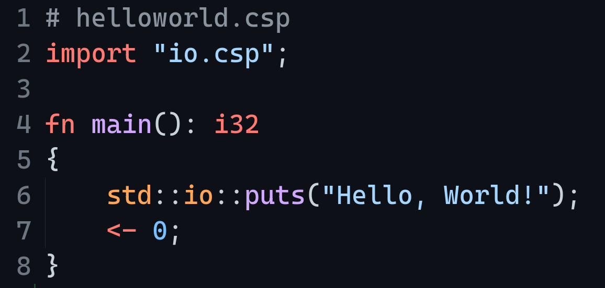
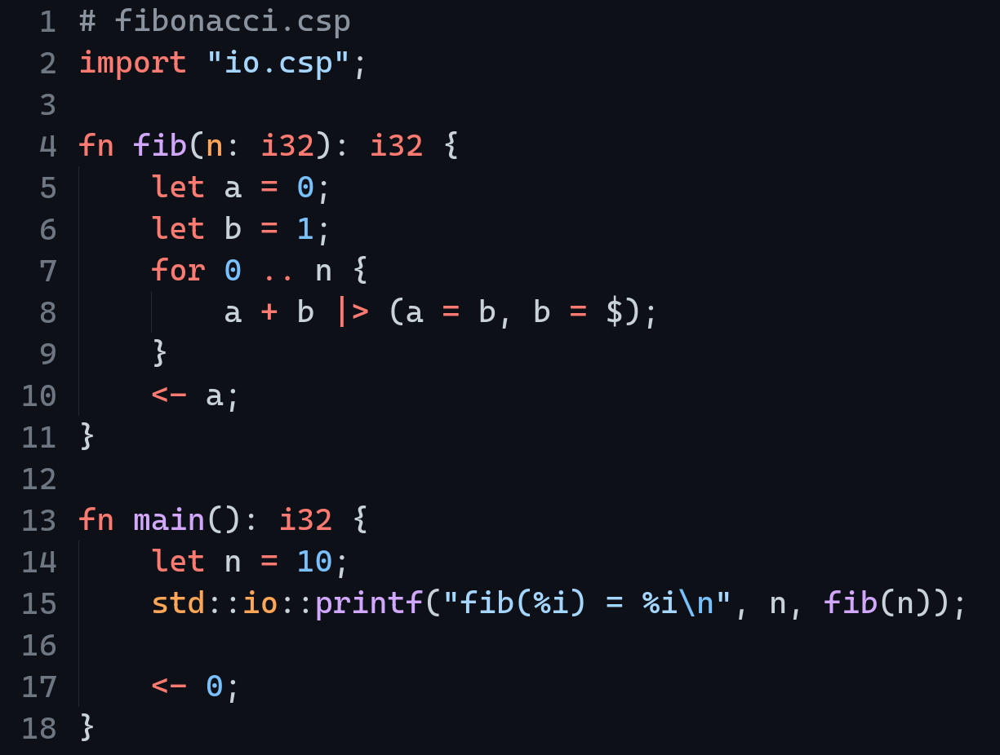
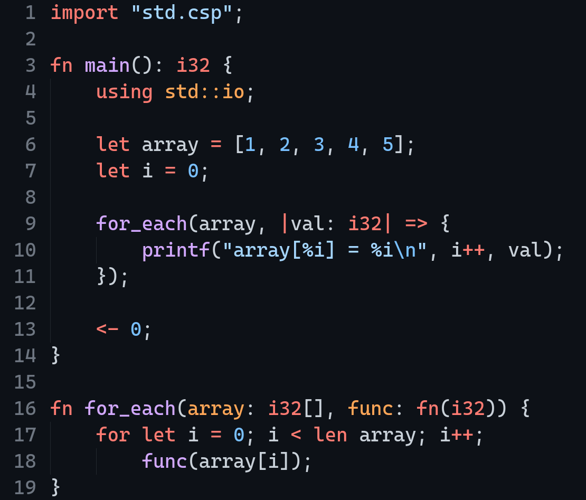
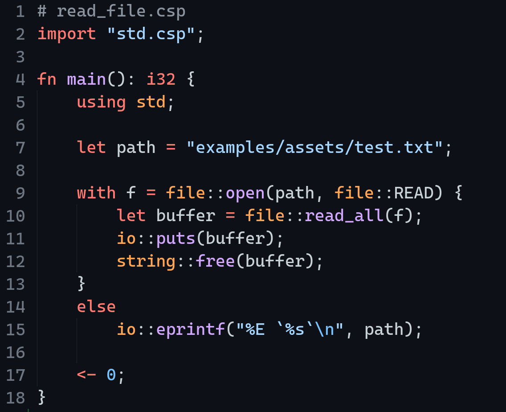
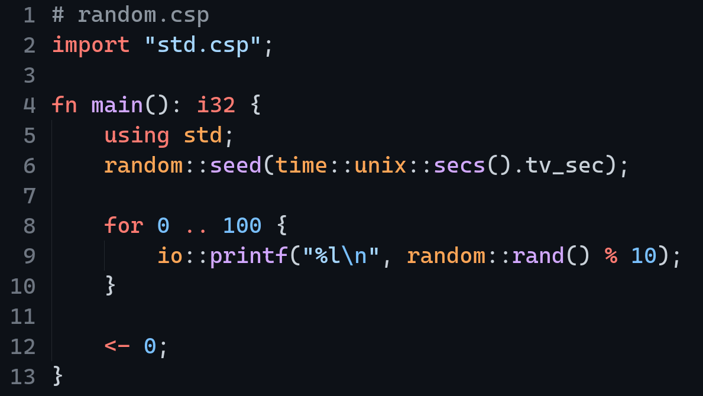

# The CSpydr Programming Language

<div align="center">

[Documentation](https://github.com/spydr06/cspydr/wiki) |
[Installation](./INSTALL.md) |
[Contributing](./CONTRIBUTING.md) |
[License](./LICENSE) |
[State](#current-status)

[](https://github.com/Spydr06/CSpydr/blob/main/LICENSE)
[](https://github.com/Spydr06/CSpydr/issues)


[](https://github.com/Spydr06/CSpydr/stargazers)
[](https://github.com/Spydr06/CSpydr/network/members)


</div>

**CSpydr** is a low-level, static typed, free and open-source, compiled programming language inspired by Rust and C. This repository contains `cspc` (the **CSpydr Programming Language Compiler**), as well as CSpydr's **Standard Libraray**, some code examples and unit tests. 

## Code Examples

<details>
<summary><b>Hello World</b></summary>

### helloworld.csp

</details>

<details>
<summary><b>Fibonacci</b></summary>

### fibonacci.csp

</details>

<details>
<summary><b>Lambda Functions</b></summary>

### lambda.csp

</details>

<details>
<summary><b>Read File</b></summary>

### read_file.csp

</details>

<details>
<summary><b>Random Number Generator</b></summary>

### random.csp

</details>

> More examples can be found in the [**examples**](./examples/) directory

## Current State

**A list of all the features, that are already implemented or planned.**

##### cspc Compiler features:
- [x] Assembly code generator for `x86_64 linux`
- [ ] LLVM codegen target (maybe even WASM?)
- [ ] move to an intermediate bytecode compiler
- [ ] AST to JSON converter (in progress)
- [x] C transpiler
- [x] lexing tokens
- [x] `macro` and `import` preprocessor
- [x] parsing an AST, validation of syntax and semantics
- [x] type evaluator & checking
- [x] implicit type casts
- [ ] "projects" - prebuild libraries such as the `stdlib`
- [x] CLI and error handling
- [x] memory management

##### CSpydr Language features:
- [x] primitive data types `i8` `i16` `i32` `i64` `u8` `u16` `u32` `u64` `f32` `f64` `f80` `bool` `char` `void`
- [x] pointers, arrays and c-like arrays `&` `[]` `'c[]`
- [x] custom data types `struct` `union` `enum` `{}` (tuples)
- [x] control statements `if` `match` `for` `while` `loop` `ret` `break` `continue` `noop` `with` `do-while` `do-unless` `defer`
- [x] different loop types: `for`, `while`, `do-while` and `loop`
- [x] expressions
- [x] `extern` functions and globals
- [x] type-related keywords `sizeof` `typeof` `alignof` `len`
- [x] file imports
- [x] macros and macro-overloading
- [x] default macros `__version__` `__system__` `__architecture__` `__time__` `__compile_type__` `__main_file__` `__file__` `__line__` `__func__` 
- [x] namespaces, functions, globals, typedefs
- [x] inline `asm` code blocks
- [x] lambda expressions
- [ ] templates in fuctions and structs
- [x] va lists
- [ ] functions as struct members

##### CSpydr Standard library features
- [x] basic `c17` `libc`-header implementation
- [x] `glfw` and `OpenGL`/`GLU` header files 
- [x] `cURL` header implementation 
- [x] from-the-ground custom written `stdlib` based on linux syscalls (in progress)

## Installation

Please refer to [INSTALL.md](./INSTALL.md) for installation instructions and information about compatability

## Hello, World!

A simple [hello-world](./examples/traditional/helloworld.csp) program:

```rust
import "io.csp";

fn main(): i32
{
    std::io::puts("Hello, World!");
    <- 0;
}
```

Running this program is as easy as entering the following command:
```console
$ cspc run hello-world.csp
```

### Examples

> For more examples, please refer to the `examples/` directory in this repository.

## Usage

To compile a CSpydr program use the following command:
```console
$ cspc build <your file>
```
To directly run a program use this command:
```console
$ cspc run <your file>
```
To launch a special debug shell, start your program using the `debug` action:
<br/>
*(not finished yet!)*
```console
$ cspc debug <your file>
```

Get help using this command:
```console
$ cspc --help
```

*(I will write a proper documentation in the future!)*

## Editor support

Editor support is found in the **[editor/](./editors)** subdirectory.

Currently, only [Visual Studio Code](https://code.visualstudio.com/) is supported.

## Contributing
Pull requests are welcome. For major changes, please open an issue first to discuss what you would like to change.

Please make sure to update the unit tests as appropriate.

**View CONTRIBUTING.md for more information**

## License
CSpydr is licensed under the [MIT License](https://mit-license.org/)

## Resources | Reference | Inspiration

- chibicc C compiler: https://github.com/rui314/chibicc.git
- vcc: https://github.com/lemoncmd/vcc.git
- tac programming language: https://github.com/sebbekarlsson/tac.git
- summus programming language: https://github.com/igor84/summus.git
- porth programming language: https://gitlab.com/tsoding/porth.git
- cURL C library for transferring data: https://github.com/curl/curl
- tiny-regex-c as the main inspiration behind `regex.csp`: https://github.com/kokke/tiny-regex-c.git
